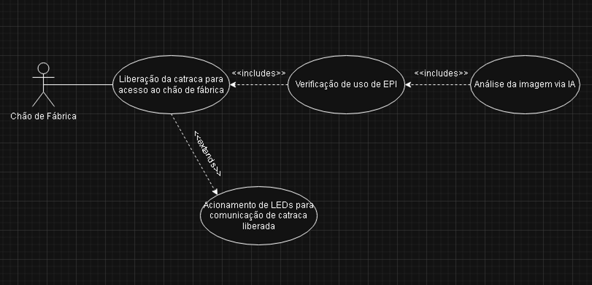
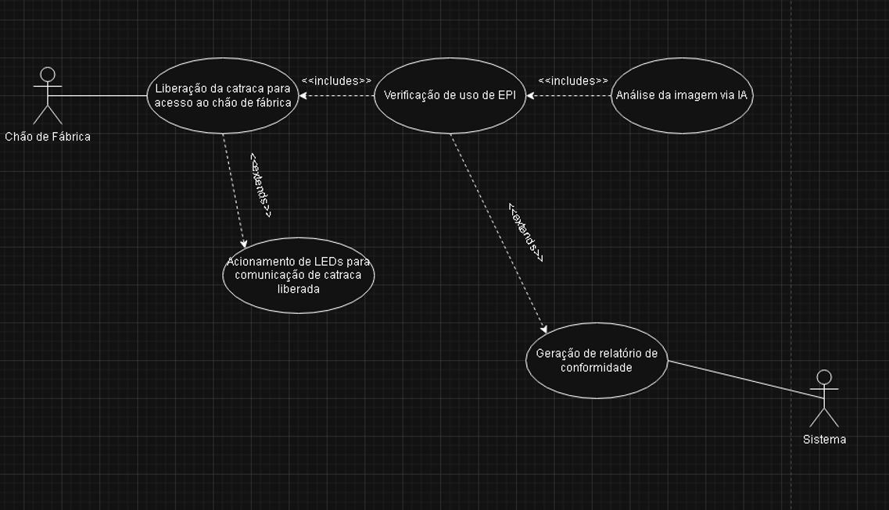
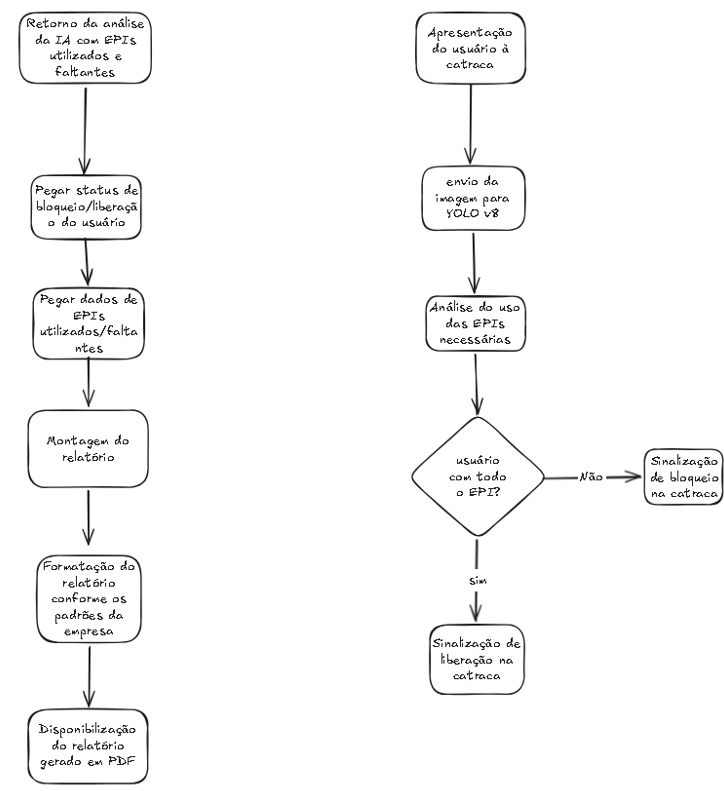

# SentraVision

**Sistema Inteligente de Monitoramento de EPIs com Visão Computacional**

---

## 👥 Integrantes

* **Breno Ferreira e Silva** - RM 555503
* **Enzo Raddatz** - RM 556312
* **Felipe Chiozzotto Gozzani** - RM 554715
* **Rafael Lopes Bestilleiro Benedetti** - RM 5554781
* **Vinicius de Abreu Fernandes** - RM 558184

---

## ⚠️ Problema Abordado

Dentro de fábricas e ambientes industriais, o uso incorreto ou a ausência de Equipamentos de Proteção Individual (EPIs) ainda é um dos principais fatores que contribuem para acidentes de trabalho. Muitas vezes, funcionários deixam de utilizar itens essenciais, como capacetes, luvas, óculos de proteção e coletes, seja por descuido, pressa ou até mesmo falta de fiscalização constante.

Esse problema pode gerar acidentes graves, colocando em risco a segurança dos trabalhadores e causando prejuízos para a empresa, como afastamentos, processos e redução da produtividade. Atualmente, grande parte da fiscalização depende apenas da supervisão humana, o que pode falhar em ambientes muito grandes ou movimentados.

---

## 💡 Proposta de Solução

O projeto **SentraVision** tem como objetivo desenvolver um sistema inteligente capaz de identificar automaticamente se os funcionários estão utilizando os EPIs corretamente durante o trabalho.

A solução será baseada em Inteligência Artificial e Visão Computacional, utilizando câmeras instaladas no ambiente industrial para realizar o monitoramento em tempo real. A IA analisará as imagens capturadas e verificará se os equipamentos obrigatórios estão sendo utilizados adequadamente.

Caso o sistema detecte a ausência de algum EPI, ele poderá emitir alertas para supervisores ou registrar a ocorrência automaticamente, ajudando a aumentar a segurança no ambiente de trabalho e reduzindo riscos de acidentes.

---

## 🛠️ Tecnologias Selecionadas

* **Python**
* **YOLOv8**
* **OpenCV**
* **Visão Computacional**
* **Inteligência Artificial**

---

## ⚙️ Justificativa Técnica

O uso do **Python** foi escolhido por ser uma linguagem amplamente utilizada no desenvolvimento de Inteligência Artificial, oferecendo diversas bibliotecas eficientes e facilidade de integração entre sistemas.

O modelo **YOLOv8 (You Only Look Once)** será utilizado por sua alta velocidade e precisão no reconhecimento de objetos em tempo real. Essa tecnologia é ideal para identificar EPIs em imagens e vídeos, permitindo um monitoramento rápido e eficiente dentro das fábricas.

Além disso, o **OpenCV** auxiliará no processamento das imagens capturadas pelas câmeras, enquanto as técnicas de **Visão Computacional** permitirão que o sistema interprete o ambiente de forma inteligente.

Com essas tecnologias, o SentraVision busca oferecer uma solução moderna, automatizada e eficiente para aumentar a segurança dos trabalhadores e auxiliar empresas na prevenção de acidentes industriais.

---

## 📊 Diagramas

### Diagrama de Casos de Uso

### Diagrama de Atividades

### Diagrama de Classes

---

## 🚀 Sprint 2: Prototipação Funcional e Navegável (UX/UI)

Nesta etapa, desenvolvemos o protótipo de alta fidelidade do SentraVision, tangibilizando a solução proposta para o ambiente da Metaindústria. O foco principal foi traduzir a modelagem técnica da Sprint 1 em uma interface funcional, focada na usabilidade direta do operador ou supervisor industrial.

### 🔗 Links Importantes

* **Protótipo Interativo (Figma):** https://www.figma.com/design/NPKZlvI3XsrA2Tiw77wimS/Sprint-2---ES?node-id=0-1&t=E4xMiBK5u3seOEny-1

### 🧭 Guia de Navegação do Protótipo

O protótipo foi estruturado com uma navegação linear e focada, permitindo que o usuário avance pelos módulos principais de forma fluida. O fluxo de teste segue:
1.  **Dashboard e Monitoramento:** A tela inicial apresenta o monitoramento ao vivo das câmeras, destacando os equipamentos essenciais (como capacete, óculos e máscara). Clique em "Avançar" no canto inferior direito para prosseguir.
2.  **Alerta de Riscos:** Visualize os "cards" com o detalhamento das infrações registradas. Utilize os botões inferiores para "Voltar" ou "Avançar".
3.  **Cadastro e Gestão de EPI (Colaborador):** Analise o perfil do funcionário e a listagem de EPIs obrigatórios para a sua função específica.
4.  **Relatório de Conformidade:** Acesse o painel analítico final com os gráficos de desempenho e métricas gerais do sistema.

### 🎨 Documentação de Design (Decisões de UX/UI)

O design da interface rompeu com a complexidade de sistemas tradicionais e focou na agilidade e clareza visual, adotando as seguintes premissas ergonômicas para a indústria:

* **Layout Vertical e Orientado:** A interface foi modelada em formato retrato (portrait), ideal para uso em smartphones corporativos entregues aos supervisores ou tótens verticais instalados próximos às catracas. 
* **Navegação Linear e Botões de Ação Rápida:** Substituímos menus complexos (hambúrguer ou barras laterais) por ações explícitas de "Avançar" e "Voltar" na base da tela, evitando toques acidentais e reduzindo a curva de aprendizado.
* **Componentes em Pílula (Pills):** O uso de componentes arredondados para listar os EPIs cria um mapeamento visual imediato. A paleta é estritamente semântica:
    * **Verde:** Equipamento presente e em conformidade.
    * **Vermelho/Laranja:** Alerta de ausência/infração (destaque imediato).
    * **Cinza:** Equipamento não exigido para aquela função (reduzindo a poluição visual).
* **Contraste e Foco (Dark Mode):** O fundo cinza chumbo contrasta agressivamente com o cabeçalho verde de localização e as marcações das *bounding boxes* geradas pela IA, garantindo que o status da operação seja a primeira coisa que o usuário note.

### 🔄 Mapeamento: Telas e Diagramas da Sprint 1

O protótipo navegável reflete diretamente as regras de negócio mapeadas na primeira etapa do projeto:

* **Dashboard de Monitoramento:** Materializa o caso de uso *"Análise da imagem via IA"*, exibindo o processamento em tempo real das câmeras 1 e 2 e as análises das *bounding boxes*.
* **Alerta de Riscos:** Reflete os caminhos alternativos do diagrama de atividades (*"Usuário com todo o EPI?" -> Não*), formalizando o bloqueio ou notificação em fichas de ocorrência detalhadas.
* **Cadastro (Colaborador):** Representa a entidade geradora dos "dados de EPIs utilizados/faltantes". Demonstra como o sistema carrega o perfil do funcionário para checar a exigência específica de equipamentos.
* **Relatório de Conformidade:** Materializa a última etapa do fluxo do diagrama de atividades (*"Geração de relatório de conformidade"*), convertendo os dados das validações em gráficos gerenciais consolidados (gráfico de rosca e de linhas).
